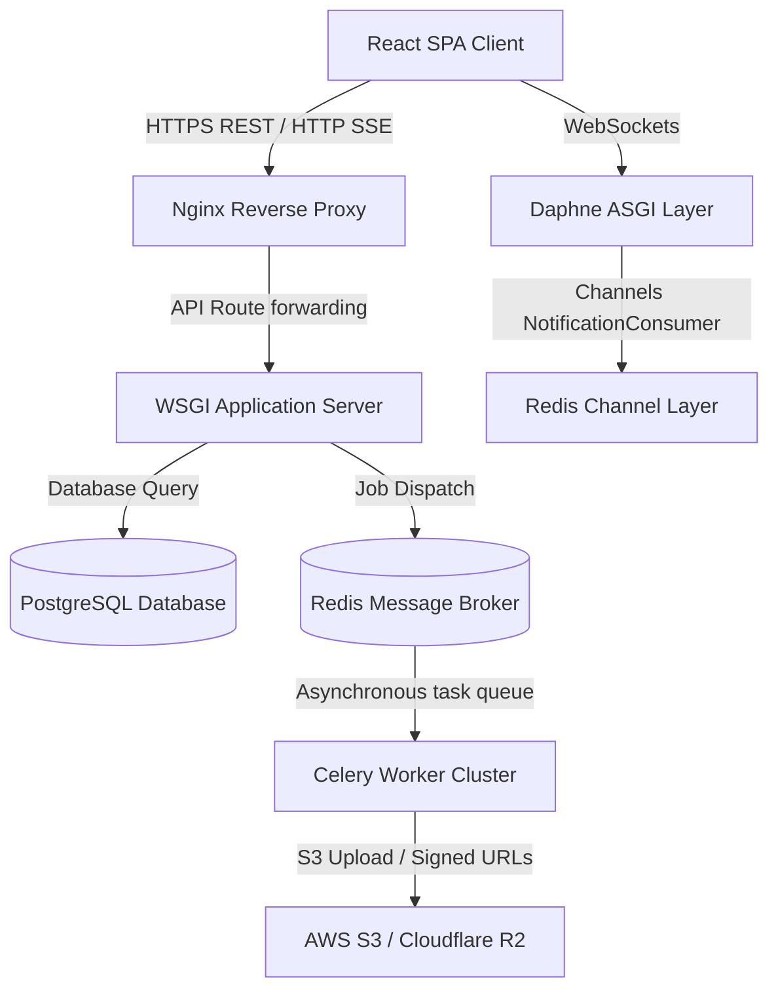

# SkillSphere System Architecture

SkillSphere is structured as a modern, decoupled web application split into a React SPA frontend and a Django REST monolith backend with real-time push capabilities and asynchronous background job pipelines.

## Architectural Flow Diagram

## Key Technologies
1. **Frontend**: Vite + React + Tailwind CSS + Lucide Icons + TanStack Query.
2. **Backend**: Python 3.12 + Django 5.0 + Django REST Framework + SimpleJWT.
3. **Real-time Server**: Daphne + Channels + Redis Channel Layer.
4. **Background Queue**: Celery + Redis.
5. **Asset Storage**: boto3 S3 Storage integrations.
