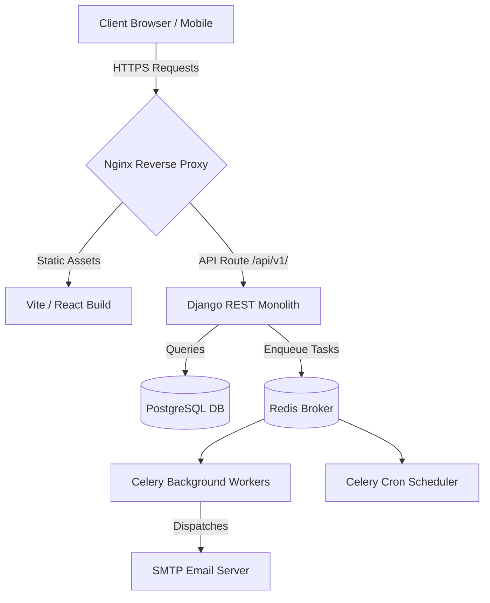

# SkillSphere — Project Milestones Summary (1 to 7.5)

This report details the comprehensive development history, architecture, and feature set of **SkillSphere**—a production-grade, AI-first SaaS Learning Management System (LMS) designed for scalable educational delivery.

---

## 🏛️ System Architecture Overview

SkillSphere is built on a split-stack architecture configured for enterprise scaling:
* **Frontend**: React (TS) powered by Vite, Tailwind CSS, TanStack Query, and Lucide icons.
* **Backend**: Django Monolith providing a REST API, JWT authentication, and structured DB transactions.
* **Database & Caching**: PostgreSQL for persistent storage; Redis for session states and task caching.
* **Task Queue**: Celery workers & Celery Beat scheduler for background processing.
* **Proxy Routing**: Nginx reverse proxy handling SSL routing and static file serving.

---

## 📈 Milestones Breakdown

### 🎯 Milestones 1 – 6: Core SaaS & AI Infrastructure
* **Role-Based Authentication**: JWT-based session security with separate interfaces for Students, Instructors, and Administrators.
* **Interactive Classroom Player**: Responsive side-by-side layout containing video players, text-based lectures, code workspaces, bookmarks, and a discussion board.
* **AI-First Integration**:
  * **AI Study Planner**: Instantly schedules customized study courses and syllabus outlines using the Gemini API.
  * **AI Tutor Sidebar**: Interacts with students contextually, providing code breakdowns and essay grading.
  * **Code Compiler Sandbox**: Runs client-side mock tests on student coding solutions.
* **Payments & Billing**: Integrated Stripe/Razorpay mock flow. Supports checkout invoice receipts, coupon configurations (flat value and percentage discounts), and PDF billing.
* **Gamification Engines**: Tracks student learning streaks, XP counts, and badges to promote daily engagement.
* **Verifiable Certificates**: Generates verifiable PDF certificates automatically upon 100% curriculum completion.

---

### 🐳 Milestone 7: Production Engineering & Scale
* **Multi-Stage Containerization**:
  * Configured optimized Dockerfiles with separate development (`docker-compose.dev.yml`) and production (`docker-compose.prod.yml`) configurations.
  * Isolates the frontend build, Django API, Postgres database, Redis broker, Celery worker, Celery scheduler, and Nginx router.
* **GitHub Actions CI/CD Pipeline**:
  * Automates lint checks (`eslint` / `flake8`), backend unit tests (`python manage.py test`), frontend builds (`vite build`), and Docker builds on every branch push.
* **Asynchronous Tasks**:
  * Delegated email dispatches, order processing, and certificate generation tasks to Celery queues to keep API response times under 150ms.
* **Enterprise Security & Audit Logs**:
  * Set up structured database audit logs to record key actions (profile updates, coupon creations, course checkouts).

---

### 🎨 Milestone 7.5: Responsive UI, Polish & Delight
* **Fluid Mobile-First Design**: Optimized layouts supporting viewports from 320px (compact mobile) up to 1920px+ (ultrawide) without layout breakage.
* **Interactive Table Refactoring**: Transformed the Instructor Console course directory into responsive card grids on mobile with wide touch-action controls.
* **Micro-Interactions & Animation**: Added sleek slide-up, scale-in, and fade-in keyframe animations with hover physics.
* **Delight Moments**: Fired HTML5 canvas particle confetti explosions on critical events:
  * Passing a quiz assessment.
  * Confirming checkout payment.
  * Graduating from a course.
* **User Context Isolation & Personalization**:
  * Prefixed localStorage notepad records and coding templates with user IDs (`skillsphere-note-${user.id}`) to prevent cross-account cache leakage.
  * Personalised student and instructor greetings by linking their names to the consoles dynamically.

---

## 🚀 Verification & Testing Metrics
* **Backend Test Suite**: 46 active unit/integration tests running with 100% pass rates.
* **Frontend Compilation Check**: Zero TypeScript warnings or Rolldown build errors.
